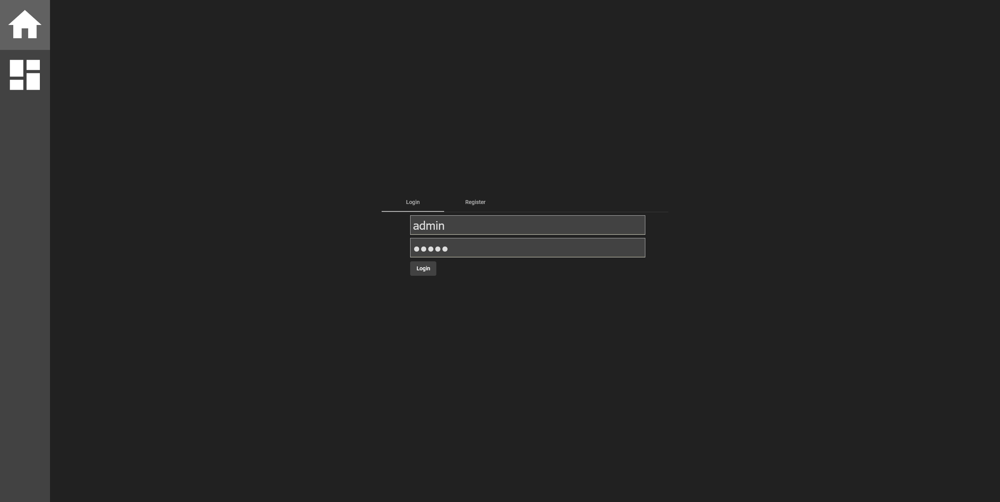
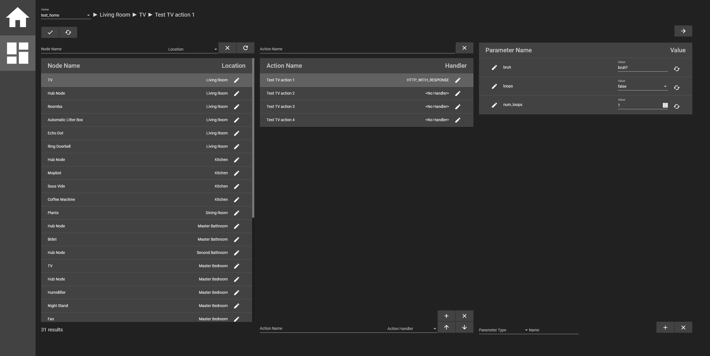

To run the fullstack Home Assistant, start with creating a kafka instance. See the readme file in under `kafka` to do this.

You will also need to run and update a postgreSQL database. See the readme file under `hadb` to do this.

After the hamsdb and kafka are up and running, you can build and start the main server by running `./gradlew :server:bootRun` in the root of this repo. 
* You can also distribute by running `./gradlew jarAll` and then cding into `dist` and running `./run_server.sh`.

You can start the node server by running `./gradlew :node_backend:bootRun` in the root of this repo. You can also distribute by running `./gradlew jarAll` and then cding into `dist` and running `./run_node.sh`.

You can then start a node ui instance by running `ng serve --open` in the `node-ui` project's directory. This will open the node's ui in your browser.

Here is the current planned architecture of the project, in a diagram that showcases how each part might communicate with the others:

Here is an up-to-date view of the standard node angular ui:

Login screen:

Dashboard:

