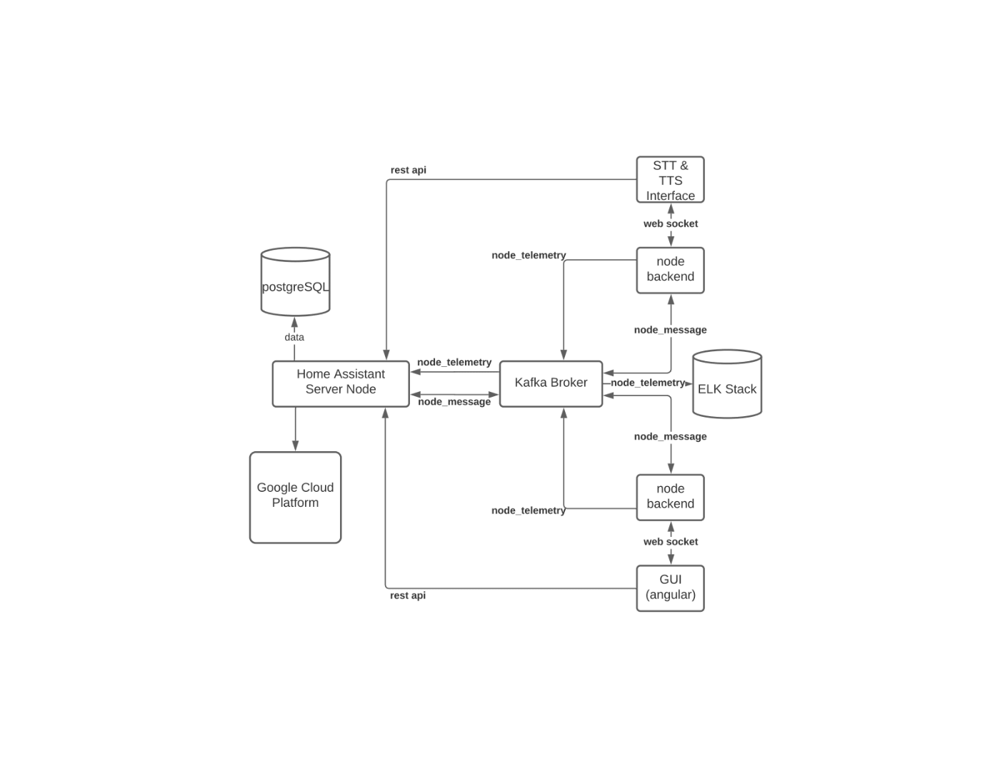

To run the fullstack Home Assistant, start by running the kafka-docker docker image (wurstmeister/kafka-docker) as is. You can also optionally build and run kafdrop to assist in development.

To start the database, view the readme under `hadb`.

After the hamsdb and kafka are up and running, you can build and start the main server by running `./gradlew :server:bootRun` in the root of this repo. You can also distribute by running `./gradlew jarAll` and then cding into `dist` and running `./run_server.sh`.

You can start the node server by running `./gradlew :node_backend:bootRun` in the root of this repo. You can also distribute by running `./gradlew jarAll` and then cding into `dist` and running `./run_node.sh`.

You can then start a node ui instance by running `ng serve --open` in the `node-ui` project's directory.

Here is the current planned architecture of the project, in a diagram that showcases how each part might communicate with the others:

